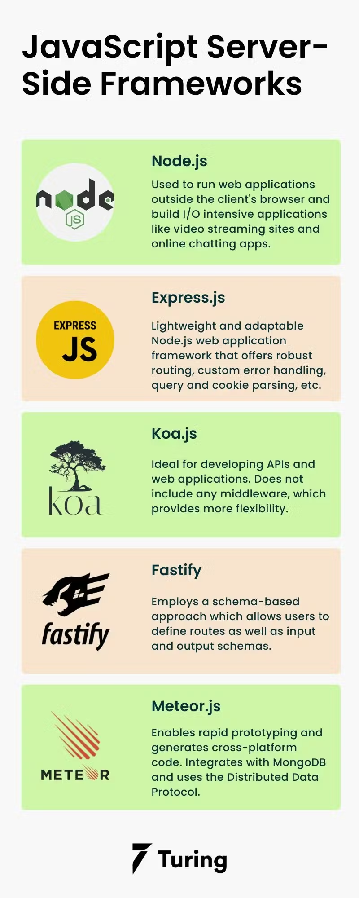

Q1. Role of Frontend (FE)
    The frontend is the client-side part of a web application. It is what users see, interact with and experince directly in their browsers.
    User Interface: 
        The frontend is responsible for designing and displaying the visual layout of the application.
        It includes:
            ->Buttons, forms, images, menus, text, icons, etc.
        It Ensures:
            ->Attractive design
            ->Proper alignment and layout
            ->Responsive behavior (works on mobile, tablet, desktop)
        Technologies commonly used:
            HTML -> structure
            CSS -> styling
            JavaScript -> dynamic behavior
            React
        Example: Login Page, dashboard layout, nav bar etc.
    User Intercation:
        Frontend handles how users interact with the application.
        Captures user actions such as:
            ->Clicking buttons
            ->Filling forms
            ->Scrolling pages
            ->Selecting options
        Improves user experience (UX) by making interactions smooth and fast.
        Example: Showing an error if the password is too short before sending data to the server.
    Communication with Backend:
        The frontend does not store or process business logic permanently.
        It communicates with the backend using:
            APIs (HTTP/HTTPS requests)
            Methods like GET, POST, PUT, DELETE
        Sends user data to the backend and receives responses such as:
            Login success/failure
            User profile data

Q2. Role of Backend (BE):
    Server-Side Processing:
        ->Handles requests received from the frontend.
        ->Applies business rules and processes data.
        ->Generates responses .
    Database Handling
        ->Stores, retrieves, updates, and deletes data.
        ->Interacts with databases like MySQL, MongoDB, PostgreSQL.
        ->Ensures data consistency and integrity.
    Security and Authentication
        ->Manages user authentication (login, signup).
        ->Implements authorization (who can access what).
Q3. Business Logic:
    Business Logic refers to the rules and conditions that define how an application works according to business requirements.
    It decides what should happen when a user performs an action.
    Real-World Examples
        1. E-Commerce Website
            Apply discount only if cart value > ₹1000
            Allow checkout only if items are in stock
        2. Banking Application
            Allow withdrawal only if balance ≥ withdrawal amount
            Charge penalty if minimum balance is not maintained
        3. Online Exam System
            Automatically submit exam when time expires
            Prevent multiple submissions from the same user

Q4. Client–Server Model:
    What is the Client–Server Model?
        It is a computing model where clients request services and servers provide services.
    Who is the Client?
        The client is the user’s device or browser.
        Examples: Chrome browser, mobile app.
        Sends requests and displays responses.
    Who is the Server?
        The server is a powerful system that processes requests.
        Handles logic, database operations, and security.
        Always available to serve clients.
    How Communication Happens?
        Client sends an HTTP request
        Server processes the request
        Server sends back an HTTP response
        Client displays the result

Q5. Three-Tier Architecture:
    It is an architecture that divides a web application into three independent layers.
    1. Presentation Layer
        User interface (Frontend)
        Displays data and captures user input
        Technologies: HTML, CSS, JavaScript, React
    2. Application (Business) Layer
        Contains business logic
        Processes requests and applies rules
        Technologies: Node.js, Java, Python
    3. Data Layer
        Manages database operations
        Stores application data
        Technologies: MySQL, MongoDB
    Why 3-Tier Architecture is Used
        ->Better scalability
        ->Easier maintenance
        ->Improved security
        ->Separation of concerns

Q6. JavaScript as a Backend Language:
    Why JavaScript is Used as a Backend Language?
    1.Performance
    Uses non-blocking, event-driven architecture
    Handles multiple requests efficiently
    Suitable for real-time applications
    2. Ecosystem
    Large number of libraries via npm
    Same language for frontend and backend
    Faster development and code reuse
    3.Popular Backend Frameworks
    Node.js – Runtime environment
    Express.js – Lightweight web framework

    
